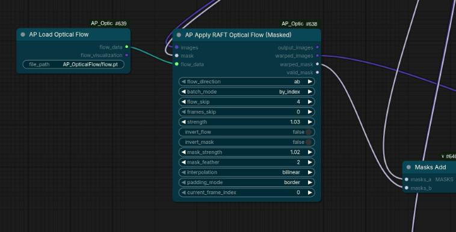
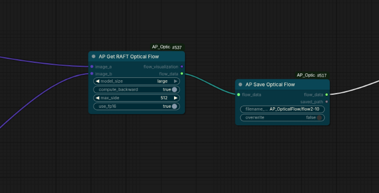
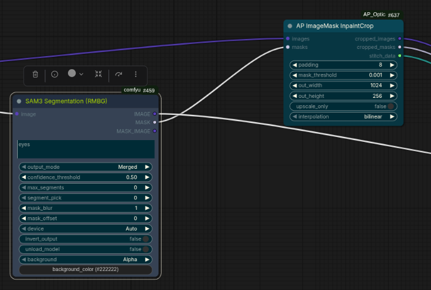

# AP_OpticalFlow

`AP_OpticalFlow` is a RAFT-based optical flow node pack for ComfyUI focused on real workflow stability: correct input/output contracts, batch-safe behavior, and loop/index support.

## Motivation

I got tired of incomplete optical flow packages that did not support correct configurations or reliable inputs/outputs in real ComfyUI graphs.

This pack exists to make optical-flow workflows practical for production-style use: temporal consistency, masked warping, index-driven loops, and clean handoff between nodes.

## Recent Changes

- Added full index-aware loop support through `current_frame_index` on flow-application nodes.
- Added `flow_skip` and `frames_skip` controls to handle offset starts and delayed flow activation.
- Added explicit batch alignment modes for flow application:
	- `auto`
	- `by_index`
	- `repeat_image`
- Added `AP Indexer` (`APIndexer`) for persistent frame indexing in iterative pipelines.
- Added `AP Select Flow By Index` (`APSelectFlowByIndex`) to pick the correct flow entry for a frame.
- Added flow persistence nodes:
	- `AP Save Optical Flow` (`APSaveOpticalFlow`)
	- `AP Load Optical Flow` (`APLoadOpticalFlow`)
- Added inpaint rectangle workflow nodes with batch support:
	- `AP ImageMask InpaintCrop` (`AP_ImageMaskInpaintCrop`)
	- `AP ImageMask Stitch` (`AP_ImageMaskStitch`)
- Added `AP_STITCH` metadata handoff type for reliable crop->inpaint->stitch roundtrips.
- Improved file path handling for load/save with output/input/current-dir resolution.
- Improved runtime robustness for some CUDA/cuDNN setups by retrying RAFT inference in float32 with cuDNN disabled when needed.

## Included Nodes

- `AP Get RAFT Optical Flow` (`APGetRAFTOpticalFlow`)
- `AP Apply RAFT Optical Flow` (`APApplyRAFTOpticalFlow`)
- `AP Flow Occlusion Mask` (`APFlowOcclusionMask`)
- `AP Apply RAFT Optical Flow (Masked)` (`APApplyRAFTOpticalFlowMasked`)
- `AP Warp IMAGE+MASK by RAFT Flow` (`APWarpImageAndMaskByRAFTFlow`)
- `AP Flow Composite` (`APFlowComposite`)
- `AP Indexer` (`APIndexer`)
- `AP Select Flow By Index` (`APSelectFlowByIndex`)
- `AP Save Optical Flow` (`APSaveOpticalFlow`)
- `AP Load Optical Flow` (`APLoadOpticalFlow`)
- `AP ImageMask InpaintCrop` (`AP_ImageMaskInpaintCrop`)
- `AP ImageMask Stitch` (`AP_ImageMaskStitch`)

## Install

1. Put this folder in ComfyUI custom nodes (or symlink it):

```bash
cp -r tools/AP_OpticalFlow custom_nodes/AP_OpticalFlow
```

2. Install dependencies in your ComfyUI environment:

```bash
python -m pip install -r custom_nodes/AP_OpticalFlow/requirements.txt
```

3. Restart ComfyUI.

## ComfyUI Manager Support

This node pack includes Manager/registry metadata in `pyproject.toml`:

- `project.name = "comfyui-ap-optical-flow"`
- `tool.comfy.PublisherId = "adampolczynski"`
- `tool.comfy.DisplayName = "AP Optical Flow"`

If you want to install/update through ComfyUI Manager, use the repository URL:

```text
https://github.com/adampolczynski/ComfyUI_AP_OpticalFlow
```

Note: to make this appear in Manager's public install catalog, it also needs to be published in the Comfy registry / Manager node list.

## Quick Workflows

### A) Temporal warp and blend

1. `APGetRAFTOpticalFlow` with frame A and frame B.
2. `APFlowOcclusionMask` from `flow_data`.
3. `APApplyRAFTOpticalFlowMasked` (or `APApplyRAFTOpticalFlow`) to warp with flow.
4. `APFlowComposite` to blend warped result back using valid/occlusion masks.



### B) Loop/index pipeline

1. `APIndexer` to produce `current_frame_index`.
2. Feed `current_frame_index` into flow nodes that support it.
3. Use `flow_skip` and `frames_skip` to align flow timing with your loop start.
4. Optionally use `APSelectFlowByIndex` for explicit flow slicing.

### B.1) Save/Load flow cache

1. Use `AP Save Optical Flow` to write `flow_data` to `.pt` in your Comfy output path.
2. Reuse it later with `AP Load Optical Flow` to skip recomputing flow.



### C) Inpaint crop/stitch pipeline

1. `AP ImageMask InpaintCrop` to extract padded crop + crop mask + `AP_STITCH` data.
2. Run your inpaint model on the cropped image/mask.
3. `AP ImageMask Stitch` to place the inpainted crop back into the original frame.



## Recommended Settings

For better quality (faces/eyes):
- `model_size`: `large`
- `compute_backward`: `true`
- `max_side`: `1536` (or `2048` if VRAM allows)
- `use_fp16`: `false` for best precision, `true` for speed

For masked warping:
- `strength`: `0.6 - 1.0`
- `mask_feather`: `3 - 8`
- `mask_strength`: `0.8 - 1.0`

For stitch blending:
- `blend_with_mask`: `true`
- `feather`: start low and increase only when seam is visible

## Notes

- Flow direction matters: if motion looks reversed, switch `ab/ba` or toggle `invert_flow`.
- Occlusion handling is important for reducing ghosting and stretching.
- In `auto` batch mode, index-based behavior is preferred when `current_frame_index` is connected.
- For fast motion or heavy blur, flow quality can still degrade.

## Known Limitations

- Depends on `torchvision` RAFT availability and compatible Torch/Torchvision versions.
- Very large inputs can be slow and VRAM-heavy.
- Not a replacement for full multi-shot tracking systems in extreme scenes.
